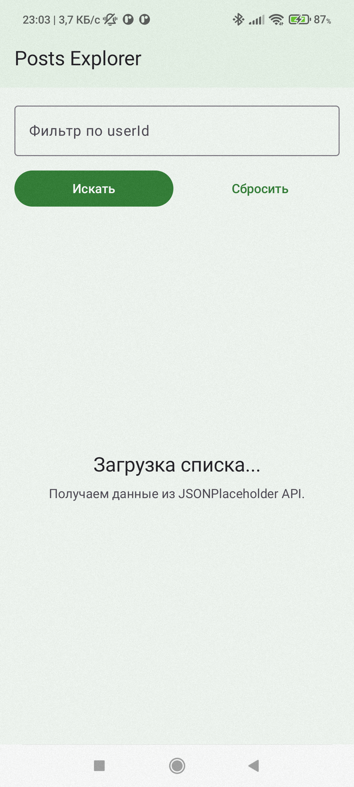
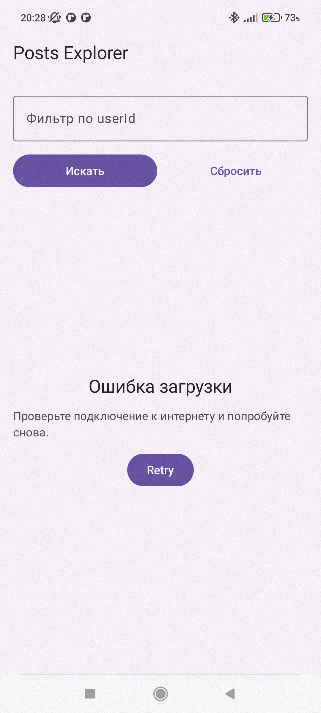
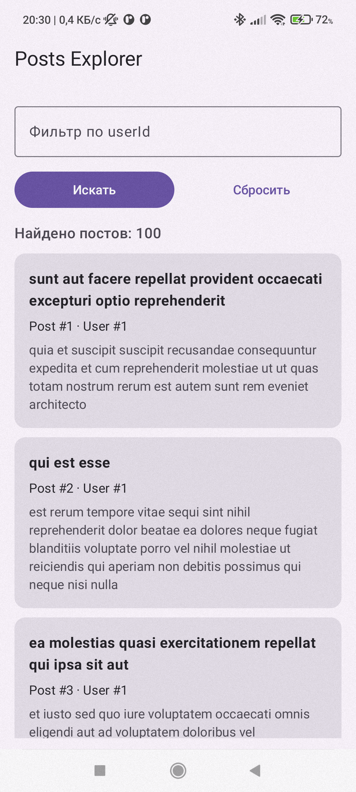
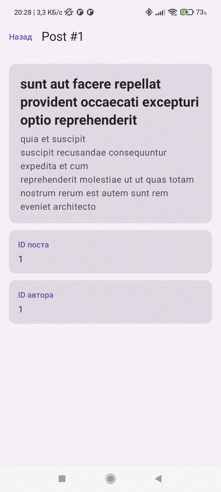

# Приложение "Posts Explorer"

## ФИО
Курышева Александра Александровна

## Группа
Б9124-09.03.03пикд(3)

## Тема приложения
Онлайн-приложение для просмотра постов из JSONPlaceholder.

## Какой API выбран
JSONPlaceholder

## Кратко суть
Приложение показывает список постов, позволяет фильтровать их по `userId` и открывать детали выбранного поста.

## Что даёт API
API возвращает тестовые посты списком и по `id`.

## Как запустить
1. Клонировать репозиторий.
2. Открыть проект в Android Studio.
3. Запустить на эмуляторе или устройстве с Android 7.0+.
4. Интернет обязателен, данные загружаются по сети.

## Нужен ли ключ
Нет, API работает без ключа.

## Скриншоты

